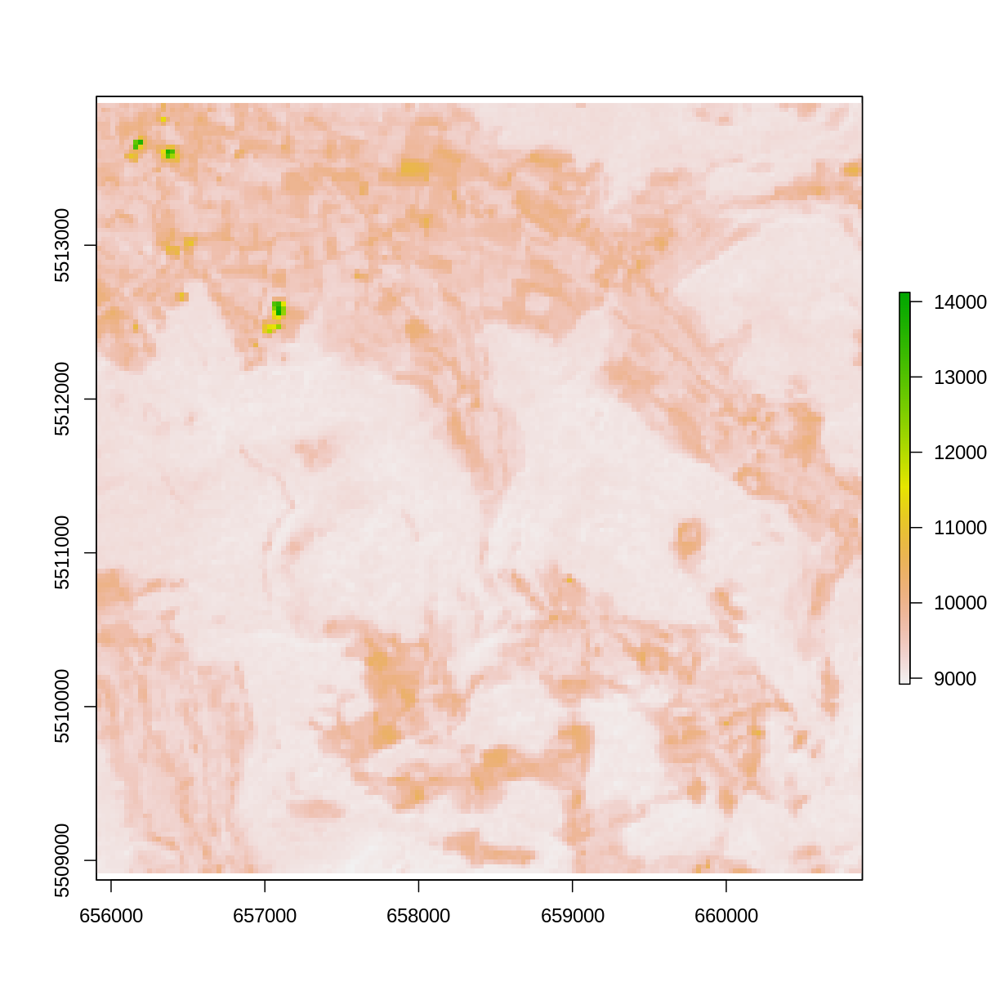
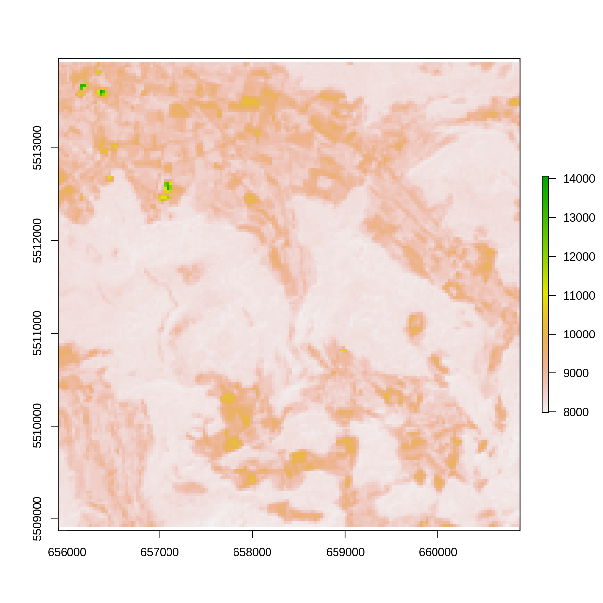
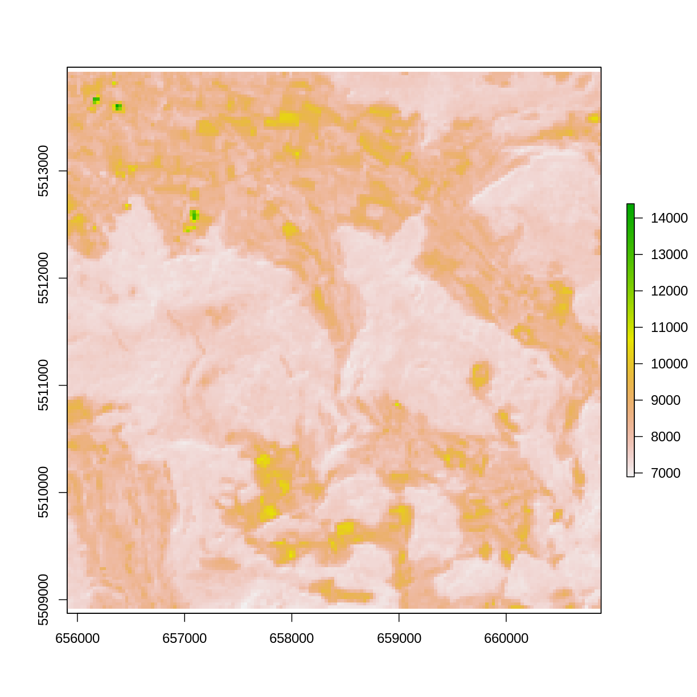

---
# Please do not edit this file directly; it is auto generated.
# Instead, please edit 01-extracting-tiff-layers.md in _episodes_rmd/
title: "Extracting tiff-layers"
teaching: 0
exercises: 0
questions:
- "Hvordan ekstraherer jeg lag fra en geotiff fil?"
objectives:
- "FIXME"
keypoints:
- "FIXME"
---

Tiff-filer kan indeholde lag. Vi er stødt på dem i en situation hvor
en studerende havde behov for at trække lagene ud af en 
GeoTIFF fil. 

Her er et eksempel på en tiff-fil med tre lag:

Vi skal bruge en række biblioteker:

~~~
library(raster)
library(sp)
library(terra)
library(proj4)
library(rgdal)
~~~
{: .language-r}

Så kan vi indlæse filen:

~~~
tif <- stack("../fig/stacked_tiff.tif")
~~~
{: .language-r}
Der er tre lag:

~~~
raster::nlayers(tif)
~~~
{: .language-r}

~~~
[1] 3
~~~
{: .output}
De har navne:

~~~
names(tif)
~~~
{: .language-r}

~~~
[1] "layer.1" "layer.2" "layer.3"
~~~
{: .output}
Og vi kan plotte dem individuelt:

~~~
plot(tif$layer.1)
~~~
{: .language-r}

plot of chunk plot-lag1

~~~
plot(tif$layer.2)
~~~
{: .language-r}

plot of chunk plot-lag2

~~~
plot(tif$layer.3)
~~~
{: .language-r}

plot of chunk plot-lag3

Vi kan også gemme dem individuelt:

~~~
writeRaster(tif$layer.3, "filnavn.tif")
~~~
{: .language-r}

## Noter

Filen er grabset fra biblioteket `plainview`, mere specifikt er det et udsnit af
sattelitfotos fra Landsat 8, omkring byen Poppendorf, lidt til højre for Rostock.

Husk også at ikke alle TIFF filer har lag. Så hvis du kun kan trække et enkelt 
lag ud, så kan det skyldes at der kun er et.

De her lagdelte TIFF filer bruges ofte  til at gennem forskellige "kanaler" i billedet.

Det kan være en kanal med landskabet set i IR-spektret. Eller tre kanaler med 
hver af farverne rød, grøn og blå. Vælger man kun at kigge på det grønne lag, 
kan det være lettere at identificere hvor vegetationen er.


