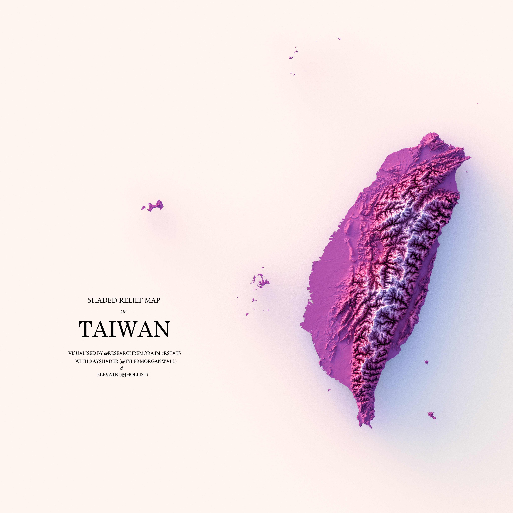

---
# Please do not edit this file directly; it is auto generated.
# Instead, please edit 02-ray-render.md in _episodes_rmd/
title: "Rayrender højdemodeller"
teaching: 0
exercises: 0
questions:
- "Key question (FIXME)"
objectives:
- "First learning objective. (FIXME)"
keypoints:
- "First key point. Brief Answer to questions. (FIXME)"
---

Enten skal det kun være eksempelkode. Eller også skal jeg uden om problemerne
med at der ikke er et grafisk interface når dette renderes.

This:

Shaded relief map of Taiwan. Made by https://mobile.twitter.com/researchremora

#How to?
These libraries

~~~
library(rgdal)
~~~
{: .language-r}

~~~
Loading required package: sp
~~~
{: .output}

~~~
Please note that rgdal will be retired during 2023,
plan transition to sf/stars/terra functions using GDAL and PROJ
at your earliest convenience.
See https://r-spatial.org/r/2022/04/12/evolution.html and https://github.com/r-spatial/evolution
rgdal: version: 1.6-4, (SVN revision 1196)
Geospatial Data Abstraction Library extensions to R successfully loaded
Loaded GDAL runtime: GDAL 3.0.4, released 2020/01/28
Path to GDAL shared files: /usr/share/gdal
GDAL binary built with GEOS: TRUE 
Loaded PROJ runtime: Rel. 6.3.1, February 10th, 2020, [PJ_VERSION: 631]
Path to PROJ shared files: /usr/share/proj
Linking to sp version:1.6-0
To mute warnings of possible GDAL/OSR exportToProj4() degradation,
use options("rgdal_show_exportToProj4_warnings"="none") before loading sp or rgdal.
~~~
{: .output}

~~~
library(dplyr)
~~~
{: .language-r}

~~~

Attaching package: 'dplyr'
~~~
{: .output}

~~~
The following objects are masked from 'package:stats':

    filter, lag
~~~
{: .output}

~~~
The following objects are masked from 'package:base':

    intersect, setdiff, setequal, union
~~~
{: .output}

~~~
library(rayshader)
~~~
{: .language-r}

~~~
Warning in rgl.init(initValue, onlyNULL): RGL: unable to open X11 display
~~~
{: .warning}

~~~
Warning: 'rgl.init' failed, running with 'rgl.useNULL = TRUE'.
~~~
{: .warning}

~~~
library(elevatr)
library(raster)
~~~
{: .language-r}

~~~

Attaching package: 'raster'
~~~
{: .output}

~~~
The following object is masked from 'package:dplyr':

    select
~~~
{: .output}

Getting the boundaries - in this example for Denmark:

~~~
denmark <- readRDS(url("https://geodata.ucdavis.edu/gadm/gadm4.0/Rsf/gadm40_DNK_0_sf.rds"))
~~~
{: .language-r}

Get the elevation from
Amazon Web Services Terrian Tiles and the Open Topography global datasets API:

~~~
dem <- get_elev_raster(denmark, z = 6)
~~~
{: .language-r}

~~~
denmark_dem <- raster::mask(dem, denmark)
~~~
{: .language-r}

~~~
denmark_mat <- raster_to_matrix(denmark_dem)
~~~
{: .language-r}

~~~
denmark_mat %>% 
  sphere_shade(texture= "imhof3") %>% 
   plot_3d(denmark_mat, windowsize = c(1200,1200),
                     zscale = 20, zoom = 0.75, phi = 89, theta = 0, fov = 0, background = "black")
~~~
{: .language-r}

~~~
render_snapshot(filename = "../fig/denmark2.png", samples = 100, width = 6000, height = 6000)
~~~
{: .language-r}



