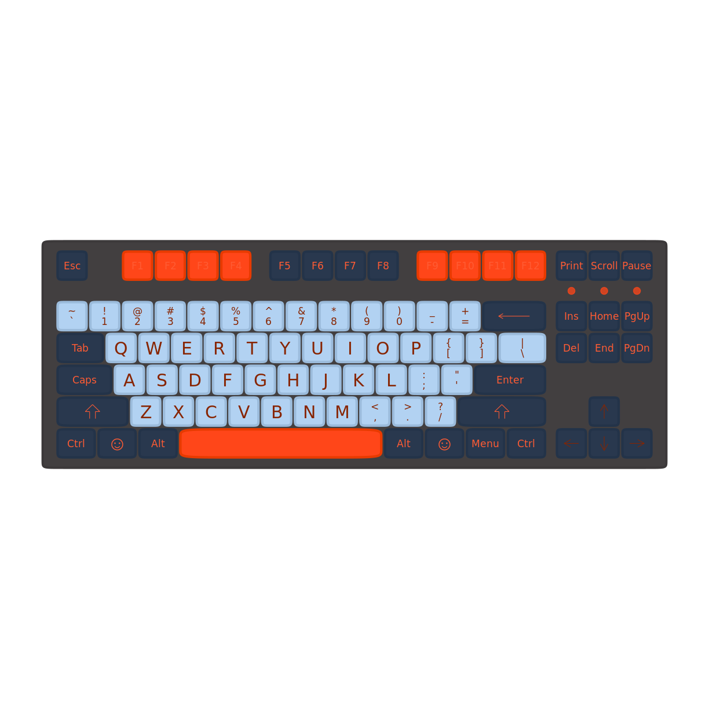
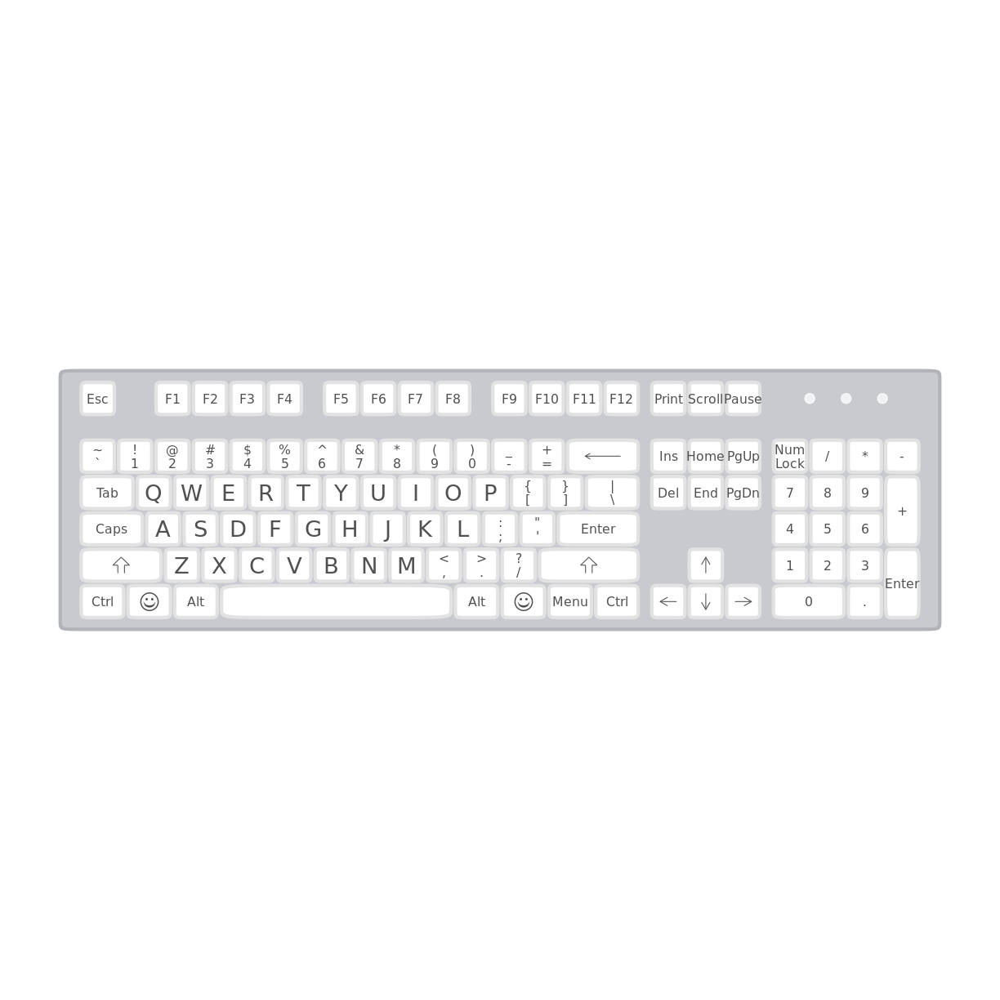
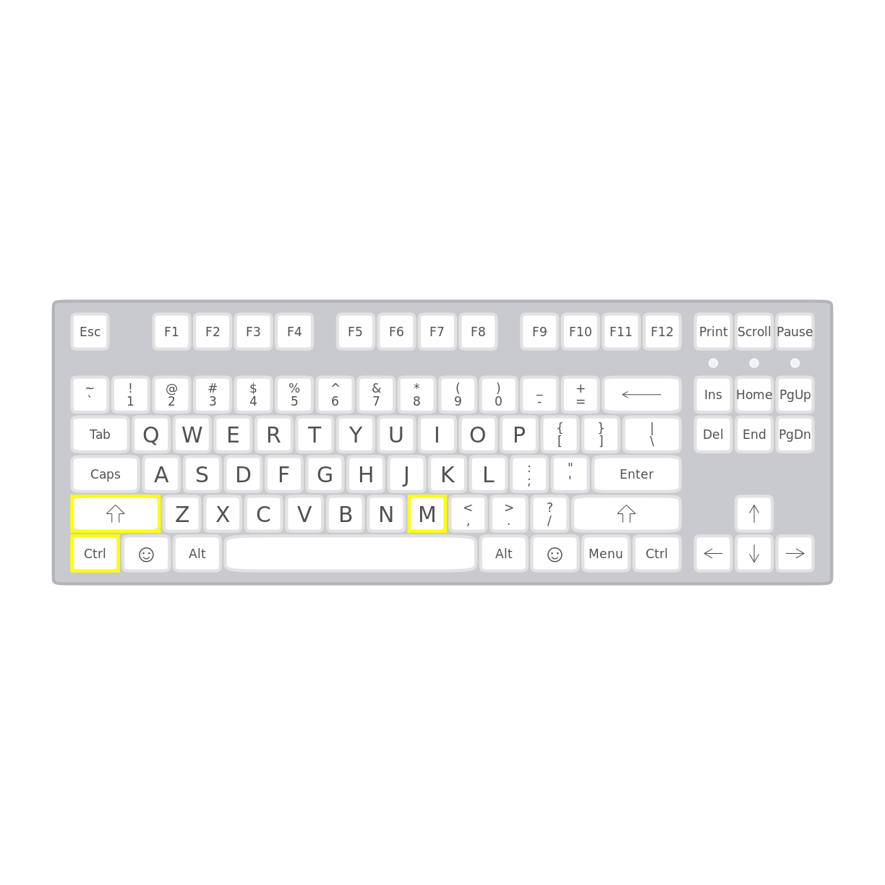
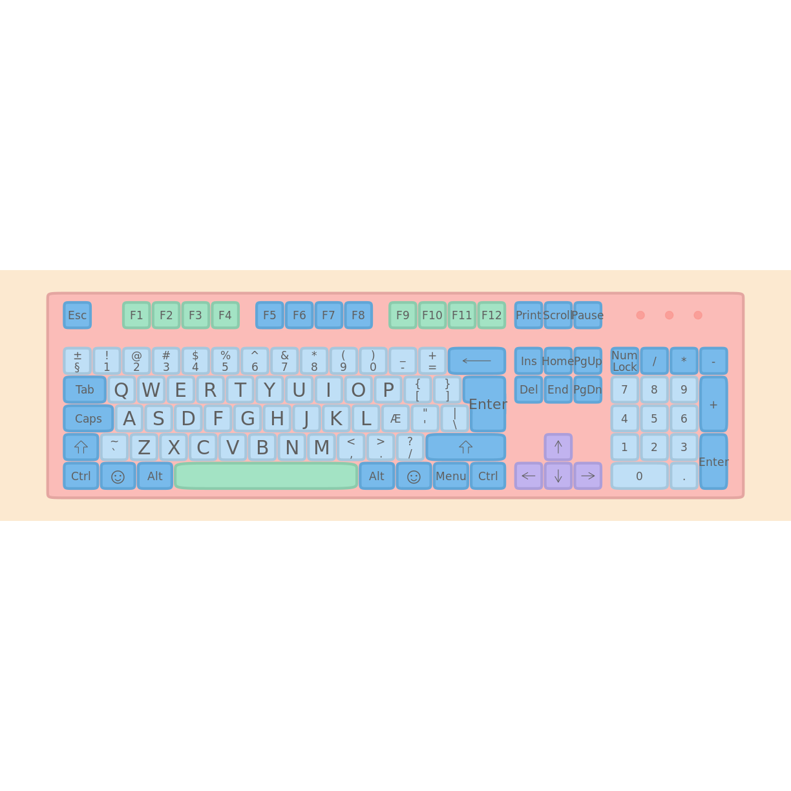

---
# Please do not edit this file directly; it is auto generated.
# Instead, please edit 09-keyboard.md in _episodes_rmd/
title: "Et keyboard"
teaching: 0
exercises: 0
questions:
  - "Key question (FIXME)"
objectives:
  - "First learning objective. (FIXME)"
keypoints:
  - "First key point. Brief Answer to questions. (FIXME)"
---

Lad os bruge det til også at vise tastaturgenveje på mac etc.

~~~
devtools::install_github("sharlagelfand/ggkeyboard", ref = "main")
~~~
{: .language-r}

~~~
Using github PAT from envvar GITHUB_PAT
~~~
{: .output}

~~~
Skipping install of 'ggkeyboard' from a github remote, the SHA1 (061f0d90) has not changed since last install.
  Use `force = TRUE` to force installation
~~~
{: .output}

Default layout. Med en - lidt annoying - palette.

~~~
library(ggkeyboard)
ggkeyboard(palette = keyboard_palette("t0mb3ry"))
~~~
{: .language-r}

der er lidt at vælge imellem. Selv synes jeg denne er at foretrække.
"full" giver os et tastatur der ligner mit.

~~~
ggkeyboard(full, palette = keyboard_palette("magic"), font_size = 2.75)
~~~
{: .language-r}

Der er også mac-tastaturer:

~~~
ggkeyboard(mac, palette = keyboard_palette("magic"))
~~~
{: .language-r}

Man kan highligte taster. Dette er tastaturkombien for %>% 

~~~
ggkeyboard(tkl, palette = keyboard_palette("magic")) %>%
  highlight_keys(c("Ctrl Left", "Shift Left", "M"))
~~~
{: .language-r}

Men hov! det ligner ikke mit tastatur?

Nej, det er fordi mit tastatur følger en ISO-standard. Og som default lader det
til at pakken følger den amerikanske ANSI-standard. 

Vi kan bedre lide ISO:

~~~
ggkeyboard(full, layout = "iso")
~~~
{: .language-r}

Jamen det ligner stadig ikke?!

Nope. Til en start skal række 3, tast 11 ikke være :;, men Æ:

~~~
full %>% 
  filter(row == 3) %>% 
  filter(number == 11)
~~~
{: .language-r}

~~~
Error in row == 3: comparison (1) is possible only for atomic and list types
~~~
{: .error}
det kan man jo lave om på:

~~~
dansk <- full
dansk[dansk$row==3 & dansk$number == 11,]$key <- "Æ"
dansk[dansk$row==3 & dansk$number == 11,]$key_label <- "Æ"
ggkeyboard(dansk, layout = "iso")
~~~
{: .language-r}

Hvorfor Æ'et ser underligt ud? Det har formentlig noget at gøre med at den default
skrifttype pakken bruger, gør mærkelige ting med Æ. Det har vi ikke kigget nærmere
på, og vi har heller ikke lavet en "dansk" der har alle relevante ændringer med,
for at få et rigtigt dansk tastatur.

Det gør vi nok en dag vi får tid.


