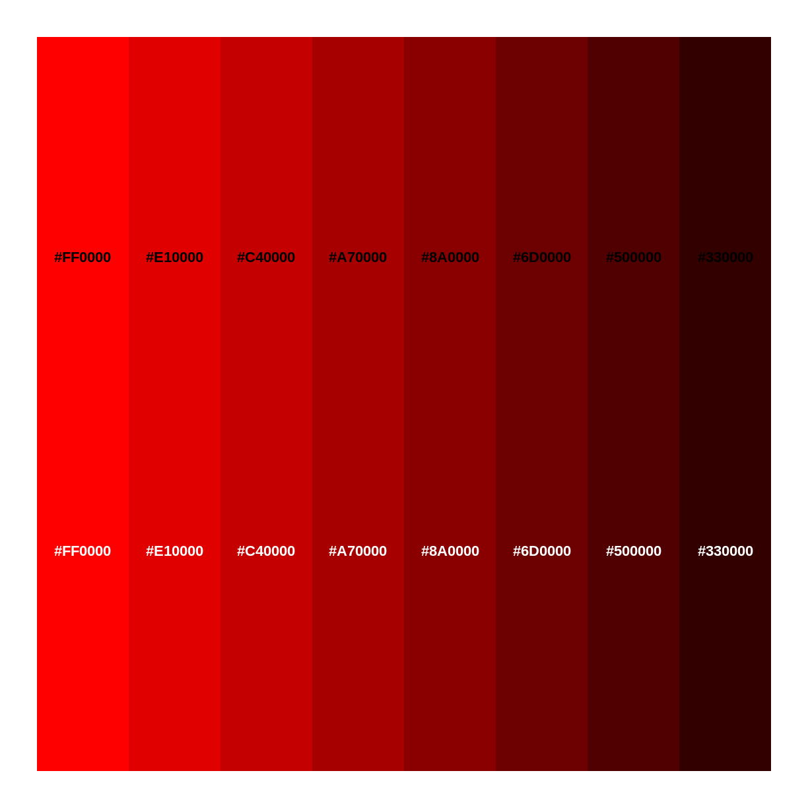
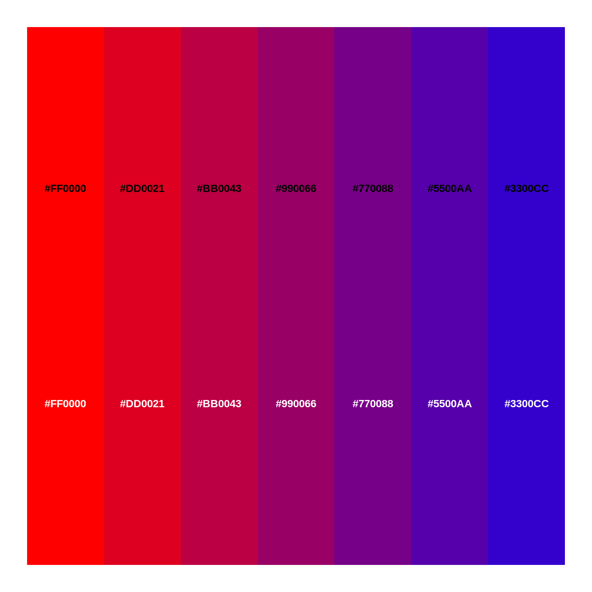
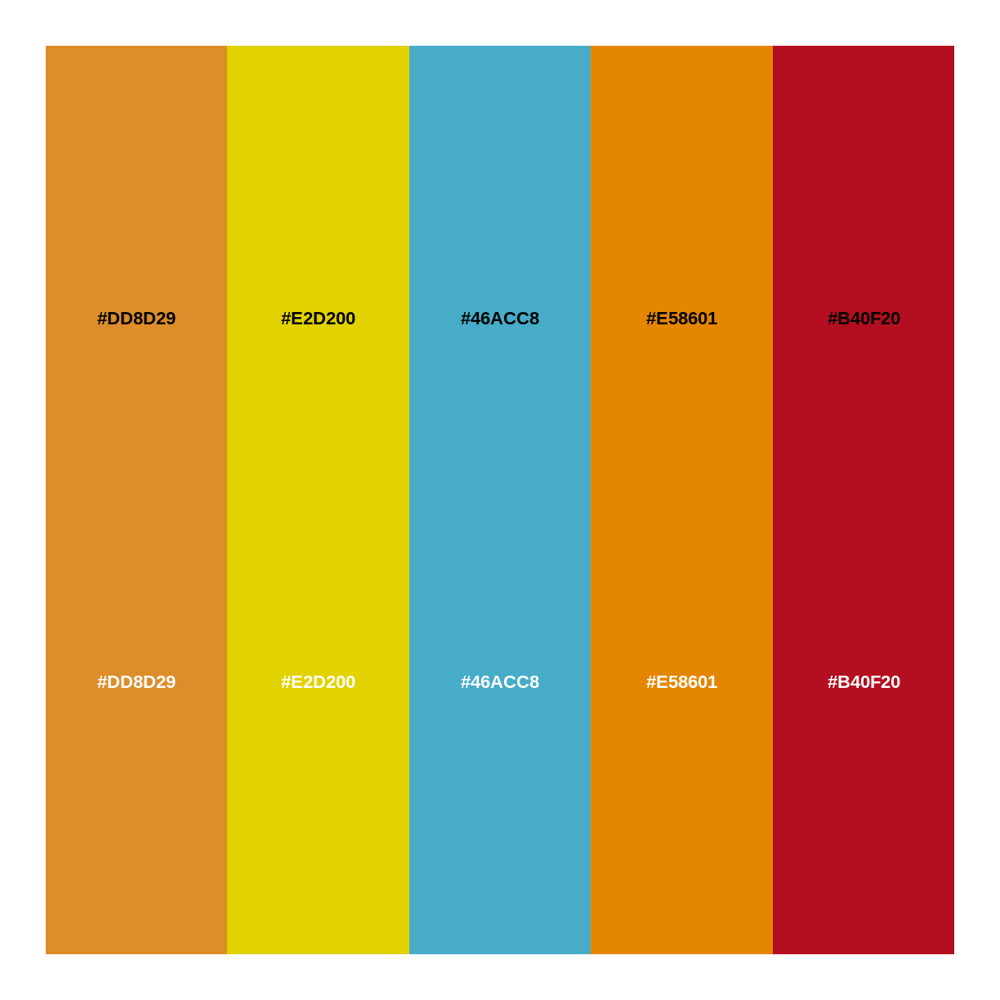
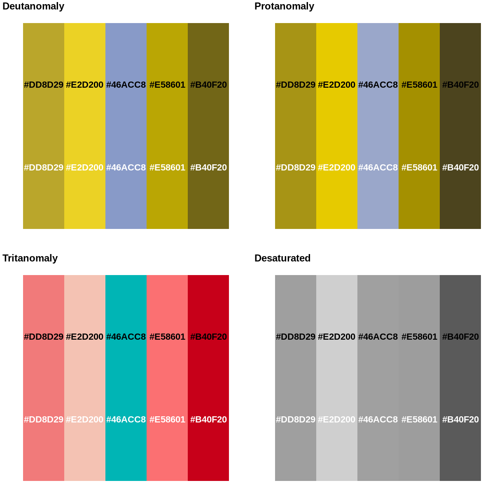

---
# Please do not edit this file directly; it is auto generated.
# Instead, please edit 15-farver-og-striber.md in _episodes_rmd/
title: "Farver og striber"
teaching: 0
exercises: 0
questions:
- "Key question (FIXME)"
objectives:
- "First learning objective. (FIXME)"
keypoints:
- "First key point. Brief Answer to questions. (FIXME)"
---

Hvordan vælger vi farver til vores plots? Hvordan laver vi vores 
egne paletter.

~~~
library(monochromeR)
~~~
{: .language-r}
Der er mange paletter at arbejde med i mange forskellige pakker.

monochromeR gør det relativt let at lave vores egen:

~~~
generate_palette("red", modification = "go_darker",
                 n_colors = 8, view_palette = T)
~~~
{: .language-r}

~~~
[1] "#FF0000" "#E10000" "#C40000" "#A70000" "#8A0000" "#6D0000" "#500000"
[8] "#330000"
~~~
{: .output}

Og hvis vi vil have blandinger af to farver, eksempelvis hvis vi vil 
have en palette der giver os farver fra en farve til en anden:

~~~
generate_palette("red", blend_color = "blue",
                 n_colors = 7, view_palette = T)
~~~
{: .language-r}

~~~

Because you supplied a blend_colour, the modification variable is set to "blend".
To use other modification options ("go_darker", "go_lighter" or "go_both_ways"),
leave blend_colour as NULL.
~~~
{: .output}

~~~
[1] "#FF0000" "#DD0021" "#BB0043" "#990066" "#770088" "#5500AA" "#3300CC"
~~~
{: .output}

Paletter kan komme fra andre steder. En populær pakke er "wesanderson", der 
leverer paletter baseret på de paletter Wes Anderson bruger i hans film. 

Pakken monochromeR kan også vise dem:

~~~
library(wesanderson)
~~~
{: .language-r}

~~~
view_palette(wesanderson::wes_palettes$FantasticFox1)
~~~
{: .language-r}

Det er ofte en god ide at tjekke hvordan ens palette bliver opfattet af farveblinde.

Pakken colorblindr giver et bud på det - og det er nok kun et bud:

~~~
library(devtools)
~~~
{: .language-r}

~~~
Loading required package: usethis
~~~
{: .output}

~~~
remotes::install_github("wilkelab/cowplot")
~~~
{: .language-r}

~~~
Using github PAT from envvar GITHUB_PAT
~~~
{: .output}

~~~
Skipping install of 'cowplot' from a github remote, the SHA1 (1f35f385) has not changed since last install.
  Use `force = TRUE` to force installation
~~~
{: .output}

~~~
install.packages("colorspace", repos = "http://R-Forge.R-project.org")
~~~
{: .language-r}

~~~
Installing package into '/home/runner/work/_temp/Library'
(as 'lib' is unspecified)
~~~
{: .output}

~~~
install_github("clauswilke/colorblindr")
~~~
{: .language-r}

~~~
Using github PAT from envvar GITHUB_PAT
~~~
{: .output}

~~~
Skipping install of 'colorblindr' from a github remote, the SHA1 (e6730be3) has not changed since last install.
  Use `force = TRUE` to force installation
~~~
{: .output}
cvd_grid bruger som udgangspunkt det sidste plot vi lavede.

~~~
library(colorblindr)
~~~
{: .language-r}

~~~
Loading required package: colorspace
~~~
{: .output}

~~~
Loading required package: ggplot2
~~~
{: .output}

~~~
view_palette(wesanderson::wes_palettes$FantasticFox1)
~~~
{: .language-r}

~~~
cvd_grid()
~~~
{: .language-r}

Hvordan bruger vi så en palette i et plot?



