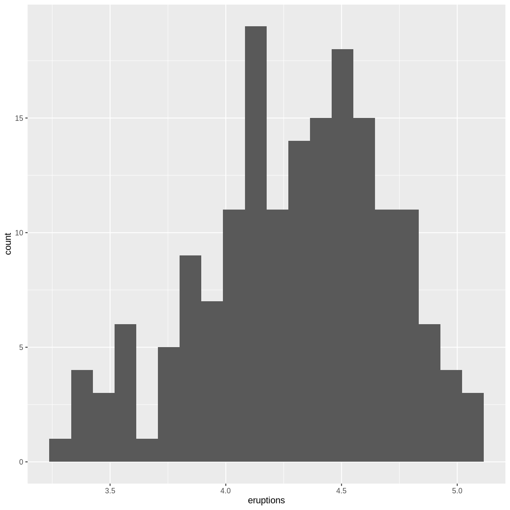
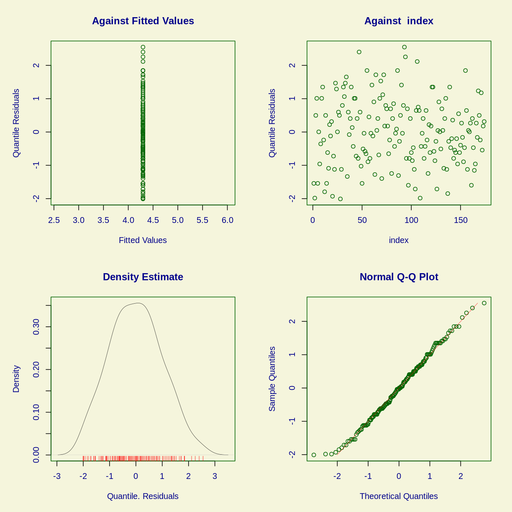

---
# Please do not edit this file directly; it is auto generated.
# Instead, please edit 16-hvilken-fordeling.md in _episodes_rmd/
title: "Hvilken statistisk fordeling følger mine data?"
teaching: 0
exercises: 0
questions:
- "Key question (FIXME)"
objectives:
- "First learning objective. (FIXME)"
keypoints:
- "First key point. Brief Answer to questions. (FIXME)"
---

Vi har noget data. Vi vil godt lave en statistisk test.
Det forudsætter ofte at data er normalfordelte. Det er de
sjældent. Men hvilken fordeling følger de så?

Vi indlæser nogen pakker, udover dem vi som default altid har med:

~~~
library(gamlss)
~~~
{: .language-r}

~~~
Loading required package: splines
~~~
{: .output}

~~~
Loading required package: gamlss.data
~~~
{: .output}

~~~

Attaching package: 'gamlss.data'
~~~
{: .output}

~~~
The following object is masked from 'package:datasets':

    sleep
~~~
{: .output}

~~~
Loading required package: gamlss.dist
~~~
{: .output}

~~~
Loading required package: MASS
~~~
{: .output}

~~~

Attaching package: 'MASS'
~~~
{: .output}

~~~
The following object is masked from 'package:dplyr':

    select
~~~
{: .output}

~~~
Loading required package: nlme
~~~
{: .output}

~~~

Attaching package: 'nlme'
~~~
{: .output}

~~~
The following object is masked from 'package:dplyr':

    collapse
~~~
{: .output}

~~~
Loading required package: parallel
~~~
{: .output}

~~~
 **********   GAMLSS Version 5.4-12  ********** 
~~~
{: .output}

~~~
For more on GAMLSS look at https://www.gamlss.com/
~~~
{: .output}

~~~
Type gamlssNews() to see new features/changes/bug fixes.
~~~
{: .output}

~~~
library(gamlss.dist)
library(gamlss.add)
~~~
{: .language-r}

~~~
Loading required package: mgcv
~~~
{: .output}

~~~
This is mgcv 1.8-42. For overview type 'help("mgcv-package")'.
~~~
{: .output}

~~~
Loading required package: nnet
~~~
{: .output}

~~~

Attaching package: 'nnet'
~~~
{: .output}

~~~
The following object is masked from 'package:mgcv':

    multinom
~~~
{: .output}

~~~
Loading required package: rpart
~~~
{: .output}

Som eksempeldata kigger vi på længden af de udbrud af
"Old Faithful" der er længere end 3.1 minut:

~~~
faithful %>% 
  filter(eruptions > 3.1) %>% 
  ggplot(aes(eruptions)) +
  geom_histogram(bins=20)
~~~
{: .language-r}

plot of chunk unnamed-chunk-3

Der er tydeligvis en fordeling. Den er vist ikke helt normal.

Hvilken fordeling passer bedst?
Vi trækker data ud, og gemmer dem som objektet `y`.

~~~
y <- faithful %>% 
  filter(eruptions > 3.1) %>% 
  pull(eruptions)
~~~
{: .language-r}

Så beder vi `fitDist` lave et fit. `k = 2` angiver at penalty i den "generaliserede Akaike Informations Kriterium" (GAIC), skal være 2. Det er i øvrigt defaultværdien.

fitDist kan fitte til mange forskellige modeller.

Her beder vi den om at fitte til fordelingsfunktioner der er defineret for reelle, positive tal.

~~~
fit <- fitDist(y, k = 2, type = "realplus")
~~~
{: .language-r}

~~~

  |                                                                            
  |                                                                      |   0%
  |                                                                            
  |===                                                                   |   4%
  |                                                                            
  |======                                                                |   9%
  |                                                                            
  |=========                                                             |  13%
  |                                                                            
  |============                                                          |  17%
~~~
{: .output}

~~~
Warning in MLE(ll2, start = list(eta.mu = eta.mu, eta.sigma = eta.sigma), :
possible convergence problem: optim gave code=1 false convergence (8)
~~~
{: .warning}

~~~

  |                                                                            
  |===============                                                       |  22%
  |                                                                            
  |==================                                                    |  26%
  |                                                                            
  |=====================                                                 |  30%
  |                                                                            
  |========================                                              |  35%
  |                                                                            
  |===========================                                           |  39%
  |                                                                            
  |==============================                                        |  43%
~~~
{: .output}

~~~
Warning in MLE(ll2, start = list(eta.mu = eta.mu, eta.sigma = eta.sigma), :
possible convergence problem: optim gave code=1 false convergence (8)
~~~
{: .warning}

~~~

  |                                                                            
  |=================================                                     |  48%
~~~
{: .output}

~~~
Warning in MLE(ll2, start = list(eta.mu = eta.mu, eta.sigma = eta.sigma), :
possible convergence problem: optim gave code=1 false convergence (8)
~~~
{: .warning}

~~~

  |                                                                            
  |=====================================                                 |  52%
~~~
{: .output}

~~~
Warning in MLE(ll2, start = list(eta.mu = eta.mu, eta.sigma = eta.sigma), :
possible convergence problem: optim gave code=1 false convergence (8)
~~~
{: .warning}

~~~

  |                                                                            
  |========================================                              |  57%
  |                                                                            
  |===========================================                           |  61%
  |                                                                            
  |==============================================                        |  65%
~~~
{: .output}

~~~
Warning in MLE(ll3, start = list(eta.mu = eta.mu, eta.sigma = eta.sigma, :
possible convergence problem: optim gave code=1 false convergence (8)
~~~
{: .warning}

~~~

  |                                                                            
  |=================================================                     |  70%
  |                                                                            
  |====================================================                  |  74%
~~~
{: .output}

~~~
Warning in nlminb(start = start, objective = f, control = optim.control):
NA/NaN function evaluation
~~~
{: .warning}

~~~
Warning in nlminb(start = start, objective = f, control = optim.control):
NA/NaN function evaluation
Warning in nlminb(start = start, objective = f, control = optim.control):
NA/NaN function evaluation
Warning in nlminb(start = start, objective = f, control = optim.control):
NA/NaN function evaluation
Warning in nlminb(start = start, objective = f, control = optim.control):
NA/NaN function evaluation
Warning in nlminb(start = start, objective = f, control = optim.control):
NA/NaN function evaluation
Warning in nlminb(start = start, objective = f, control = optim.control):
NA/NaN function evaluation
~~~
{: .warning}

~~~

  |                                                                            
  |=======================================================               |  78%
  |                                                                            
  |==========================================================            |  83%Error in solve.default(oout$hessian) : 
  Lapack routine dgesv: system is exactly singular: U[4,4] = 0

  |                                                                            
  |=============================================================         |  87%
~~~
{: .output}

~~~
Warning in MLE(ll4, start = list(eta.mu = eta.mu, eta.sigma = eta.sigma, :
possible convergence problem: optim gave code=1 false convergence (8)
~~~
{: .warning}

~~~

  |                                                                            
  |================================================================      |  91%
  |                                                                            
  |===================================================================   |  96%
  |                                                                            
  |======================================================================| 100%
~~~
{: .output}

~~~
Warning in nlminb(start = start, objective = f, control = optim.control):
NA/NaN function evaluation
Warning in nlminb(start = start, objective = f, control = optim.control):
NA/NaN function evaluation
~~~
{: .warning}

~~~
Warning in MLE(ll4, start = list(eta.mu = eta.mu, eta.sigma = eta.sigma, :
possible convergence problem: optim gave code=1 function evaluation limit
reached without convergence (9)
~~~
{: .warning}
Det er ikke alle fordelingerne det går lige godt for. Vi er alligevel mest interesserede i dem hvor det går godt.

Så beder vi om summary:

~~~
summary(fit)
~~~
{: .language-r}

~~~
*******************************************************************
Family:  c("WEI3", "Weibull type 3") 

Call:  gamlssML(formula = y, family = DIST[i]) 

Fitting method: "nlminb" 

Coefficient(s):
            Estimate  Std. Error  t value   Pr(>|t|)    
eta.mu    1.45805022  0.00727488 200.4226 < 2.22e-16 ***
eta.sigma 2.53865087  0.05913006  42.9333 < 2.22e-16 ***
---
Signif. codes:  0 '***' 0.001 '**' 0.01 '*' 0.05 '.' 0.1 ' ' 1

 Degrees of Freedom for the fit: 2 Residual Deg. of Freedom   172 
Global Deviance:     168.557 
            AIC:     172.557 
            SBC:     178.875 
~~~
{: .output}
Og får at vide at det bedste bud på en sandsynlighedsfordeling for disse data er "Weibull type 3". Den er faktisk mistænkelig god... 

Vi får også parametrene for den.

Beder vi om at plotte fittet, får vi dette output:

~~~
plot(fit)
~~~
{: .language-r}

plot of chunk unnamed-chunk-7

~~~
******************************************************************
	      Summary of the Quantile Residuals
                           mean   =  -0.0006881363 
                       variance   =  0.9877502 
               coef. of skewness  =  0.1409664 
               coef. of kurtosis  =  2.492531 
Filliben correlation coefficient  =  0.996398 
******************************************************************
~~~
{: .output}
Det er et pænt QQ-plot.

## Hvordan med de andre muligheder?

Dem kan vi også få: 

~~~
fit$fits
~~~
{: .language-r}

~~~
    WEI3     WEI2      WEI     BCPE    BCPEo       GG    BCCGo     BCCG 
172.5570 172.5570 172.5570 173.4852 173.4852 174.1330 175.8950 175.8950 
     GB2     BCTo      BCT   exGAUS       GA       IG   LOGNO2    LOGNO 
176.1332 177.8950 177.8951 181.0741 184.0635 187.2187 187.2190 187.2190 
  IGAMMA      EXP  PARETO2 PARETO2o       GP 
190.8078 857.4636 859.4638 859.4638 859.4638 
~~~
{: .output}
Og det var så de fordelinger der er definerede for reelle, positive tal. Vi går efter den mindste "deviance" - afvigelsen fra idealet. Bemærk at jo flere datapunkter vi har, jo større bliver tallene. Det bedste fit er dog stadig det med den laveste værdi.

"realline" dækker kontinuerte fordelingsfunktioner på hele den reelle tallinie

"realplus" dækker kontinuerte fordelingsfunktioner på den positive, reelle tallinie

"realAll" har alle kontinuerte fordelingsfunktioner på hele den relle tallinie, det vil sige alt der er omfattet af "realline" og "realplus"

"real0to1" de kontinuerte fordelingsfunktioner der er defineret for værdier mellem 0 og 1.

"counts" fordelingsfunktioner for tælletal

"binom" fordelingsfunktioner for binomiale data.

Der er mange. Læs mere om dem i [dokumentationen](https://www.gamlss.com/wp-content/uploads/2013/01/gamlss-manual.pdf), særligt appendix A.
   
## Hvordan med de andre fordelinger?

Inde bagved er `fitDist` i virkeligheden gentagne kald til den samme funktion.
Det afsløres i outputtet:
`Call:  gamlssML(formula = y, family = DIST[i])` 

Så vil vi gerne have estimaterne fra de andre funktioner, kan vi få dem ved
at lave samme kald - men med en anden `family`:

~~~
nyt_fit <- gamlssML(formula = y, family = "GG")
nyt_fit
~~~
{: .language-r}

~~~

Family:  c("GG", "generalised Gamma Lopatatsidis-Green") 
Fitting method: "nlminb" 

Call:  gamlssML(formula = y, family = "GG") 

Mu Coefficients:
[1]  1.492
Sigma Coefficients:
[1]  -2.506
Nu Coefficients:
[1]  10.42

 Degrees of Freedom for the fit: 3 Residual Deg. of Freedom   171 
Global Deviance:     168.133 
            AIC:     174.133 
            SBC:     183.61 
~~~
{: .output}
Resultatet kan behandles ganske som tidligere.



