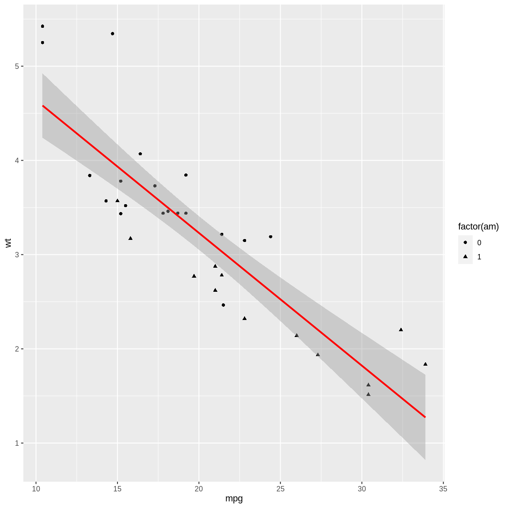
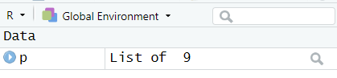
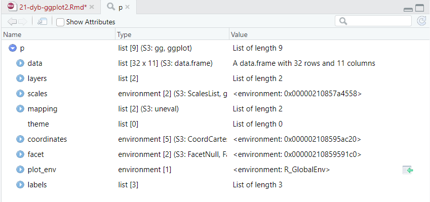
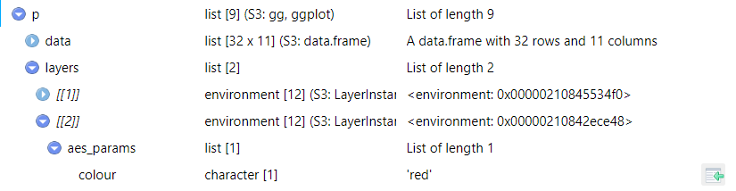

---
# Please do not edit this file directly; it is auto generated.
# Instead, please edit 21-dyb-ggplot2.md in _episodes_rmd/
title: "Avanceret redigering af ggplot2 plots"
teaching: 0
exercises: 0
questions:
- "Key question (FIXME)"
objectives:
- "First learning objective. (FIXME)"
keypoints:
- "First key point. Brief Answer to questions. (FIXME)"
---

Vi har et ggplot. Hvordan piller vi i ting der ligger dybt inde i det?

Vi tager et fjollet eksempel:

~~~
library(tidyverse)
~~~
{: .language-r}

~~~
── Attaching core tidyverse packages ──────────────────────── tidyverse 2.0.0 ──
✔ dplyr     1.1.2     ✔ readr     2.1.4
✔ forcats   1.0.0     ✔ stringr   1.5.0
✔ ggplot2   3.4.2     ✔ tibble    3.2.1
✔ lubridate 1.9.2     ✔ tidyr     1.3.0
✔ purrr     1.0.1     
── Conflicts ────────────────────────────────────────── tidyverse_conflicts() ──
✖ dplyr::filter() masks stats::filter()
✖ dplyr::lag()    masks stats::lag()
ℹ Use the conflicted package (<http://conflicted.r-lib.org/>) to force all conflicts to become errors
~~~
{: .output}

~~~
p <- ggplot(mtcars, aes(mpg, wt )) +
  geom_point(aes(shape = factor(am))) +
  geom_smooth(method = lm, color = "red")
p
~~~
{: .language-r}

~~~
`geom_smooth()` using formula = 'y ~ x'
~~~
{: .output}

plot of chunk unnamed-chunk-2

Nu vil vi godt have regressionslinien til at være blå, i stedet for rød. 
Det er et fjollet eksempel, for det er jo blot at ændre i color argumentet i
geom_smooth. Men lad os nu prøve.

Objektet p optræder i environment:

Det er her vi får afsløret at p ikke er selve plottet, men et list-object,
der indeholder de instruktioner der skal til for at lave plottet. 

Det betyder også, at hvis vi ellers kan finde ud af hvad der skal
skrives til hvor i den liste - så kan vi pille i _alt_ i plottet.

Klik nu på luppen ud for "List of 9" - og vi få et view af p, som 
vi kan kigge videre på:

Og hvordan finder man så det man leder efter? Søgefunktionen er fristende;
vi ved at farven er sat til "red", men vi har ikke endnu gennemskuet hvad der skal til for at den bliver fundet. En gang i mellem dukker den op
i søgningen. Andre gange ikke.

Vi ved dog at det er lag 2 vi skal have fat på - hver geom_ tilføjer et lag, og geom_smooth bliver lagt på som lag nr. 2.

Den kan vi folde ud, og så er den der:

Længst til højre er der - og den dukker op efterhånden som man
fører musen over elementerne, en lille ikon. Klik på den, og den 
base-R kodestump der subsetter præcist det element overføres til 
konsollen:

~~~
p[["layers"]][[2]][["aes_params"]][["colour"]]
~~~
{: .language-r}

~~~
[1] "red"
~~~
{: .output}

Vi kan nu skrive en anden værdi til den - og skifte farven.

Teknikken fungerer generelt - vi kan justere på _alt_ i objektet. 

Det kan være vanskeligt programmatisk at få de nødvendige oplysninger. Men det 
kan gøres. Her foreslår vi at pakken `gginnards` bruges - i hvert fald til vi
har pillet dens funktioner fra hinanden og gennemskuet hvordan man selv får fingre
i tingene.

Hvis man ønsker at pille i eksempelvis farven, er det her nødvendigt at finde
ud af hvilket af de to lag - og der kunne være flere - der indeholder `geom_smooth`.

Det kan gøres på denne måde:

~~~
library(gginnards)
which_layers(p, "GeomSmooth")
~~~
{: .language-r}



