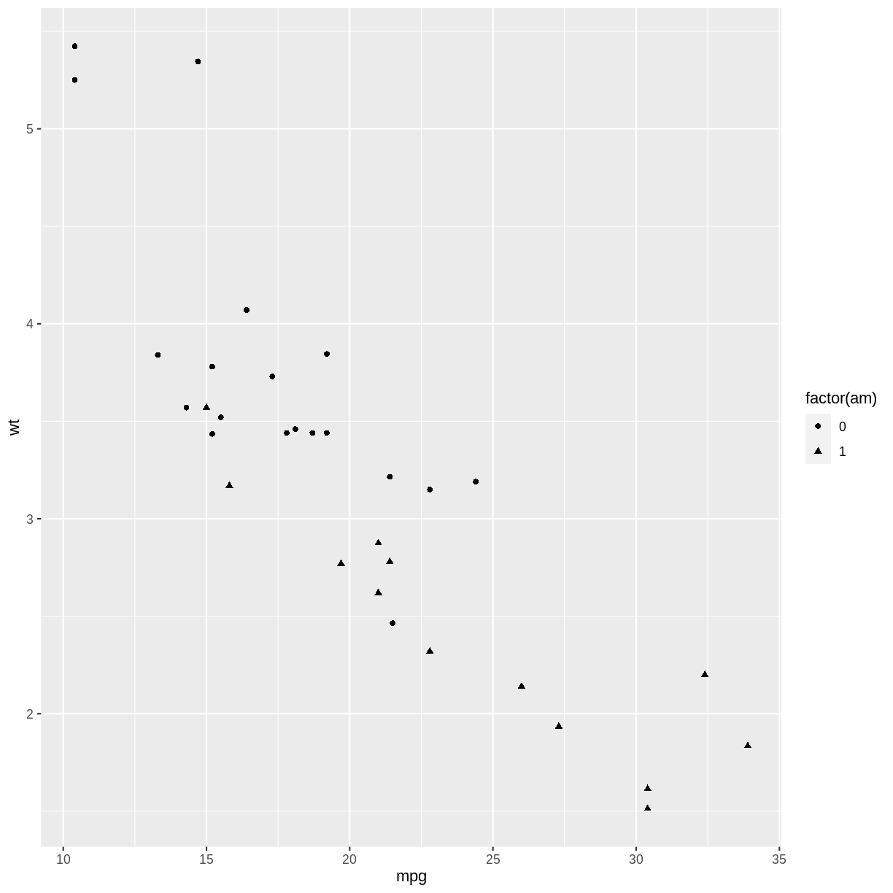
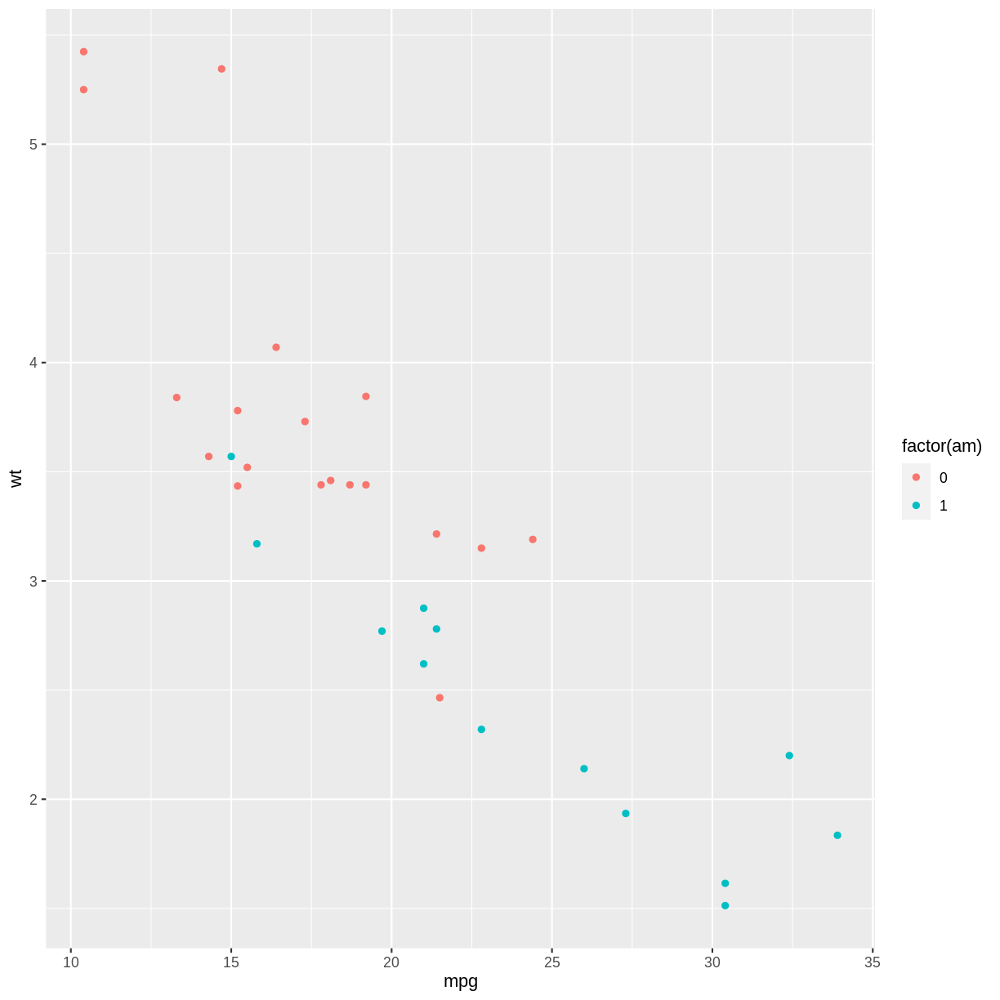

---
# Please do not edit this file directly; it is auto generated.
# Instead, please edit 22-programmer-ggplot2.md in _episodes_rmd/
title: "Juster på ggplots programmatisk"
teaching: 0
exercises: 0
questions:
- "Key question (FIXME)"
objectives:
- "First learning objective. (FIXME)"
keypoints:
- "First key point. Brief Answer to questions. (FIXME)"
---

Eller hvad det nu hedder. Vi vil godt kunne lade et script styre om 
punkter i et plot skal plottes med color i stedet for shape:

~~~
library(tidyverse)
~~~
{: .language-r}

~~~
── Attaching core tidyverse packages ──────────────────────── tidyverse 2.0.0 ──
✔ dplyr     1.1.2     ✔ readr     2.1.4
✔ forcats   1.0.0     ✔ stringr   1.5.0
✔ ggplot2   3.4.2     ✔ tibble    3.2.1
✔ lubridate 1.9.2     ✔ tidyr     1.3.0
✔ purrr     1.0.1     
── Conflicts ────────────────────────────────────────── tidyverse_conflicts() ──
✖ dplyr::filter() masks stats::filter()
✖ dplyr::lag()    masks stats::lag()
ℹ Use the conflicted package (<http://conflicted.r-lib.org/>) to force all conflicts to become errors
~~~
{: .output}

~~~
mtcars %>% 
  ggplot(aes(mpg, wt, shape = factor(am))) +
  geom_point()
~~~
{: .language-r}

plot of chunk unnamed-chunk-2

Det gør vi ved at bruge tidy evaluation idiomer. 

~~~
noget <- "am"
andet <- "color"
mtcars %>% 
  ggplot(aes(mpg, wt, !!andet := factor(!!as.symbol(noget)))) +
  geom_point()
~~~
{: .language-r}

plot of chunk unnamed-chunk-3

Det funger ikke alene her - det fungerer også med de øvrige tidyverse
funktioner. 

Hvad hvis vi godt ville plotte med geom_lines i stedet for geom_point?

Fungerer det også med dplyr?

~~~
mtcars %>% 
  group_by(!!as.symbol(noget)) %>% 
  summarise(n = n()) %>% 
  mutate(test = !!andet)
~~~
{: .language-r}

~~~
# A tibble: 2 × 3
     am     n test 
  <dbl> <int> <chr>
1     0    19 color
2     1    13 color
~~~
{: .output}
Vil vi styre hvilken geom vi skal bruge, vil det her virke:

~~~
a <- "geom_point()"  # eller a <- "geom_line"

mtcars %>%
  ggplot(aes(mpg, wt, shape = factor(am))) +
  eval(parse(text = a))  # Evaluere og udføre den dynamiske funktion
~~~
{: .language-r}

plot of chunk unnamed-chunk-5



