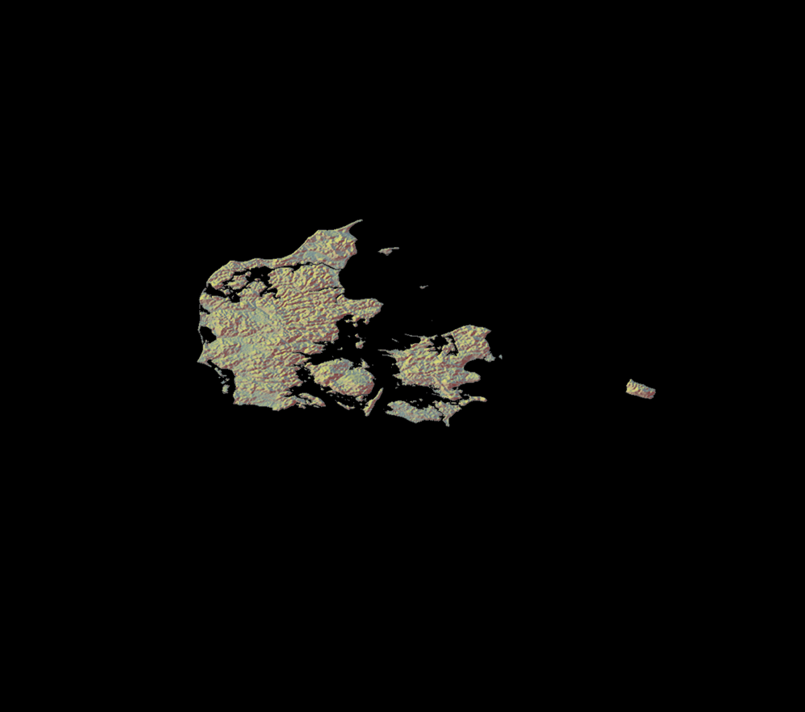

```{r, include = FALSE}
source("../bin/chunk-options.R")
knitr_fig_path("02-")
```

```{r setup, include=FALSE}
knitr::opts_chunk$set(echo = TRUE)
```

Enten skal det kun være eksempelkode. Eller også skal jeg uden om problemerne
med at der ikke er et grafisk interface når dette renderes.

This:
```{r, echo = F, out.width = "400px"}
knitr::include_graphics("../fig/taiwan.jpg")
```

Shaded relief map of Taiwan. Made by https://mobile.twitter.com/researchremora

#How to?
These libraries
```{r}
library(rgdal)
library(dplyr)
library(rayshader)
library(elevatr)
library(raster)
```

Getting the boundaries - in this example for Denmark:
```{r}
denmark <- readRDS(url("https://geodata.ucdavis.edu/gadm/gadm4.0/Rsf/gadm40_DNK_0_sf.rds"))
```

Get the elevation from
Amazon Web Services Terrian Tiles and the Open Topography global datasets API:
```{r}
dem <- get_elev_raster(denmark, z = 6)
```


```{r}
denmark_dem <- raster::mask(dem, denmark)
```


```{r}
denmark_mat <- raster_to_matrix(denmark_dem)
```


```{r}
denmark_mat %>% 
  sphere_shade(texture= "imhof3") %>% 
   plot_3d(denmark_mat, windowsize = c(1200,1200),
                     zscale = 20, zoom = 0.75, phi = 89, theta = 0, fov = 0, background = "black")
```


```{r}
render_snapshot(filename = "../fig/denmark2.png", samples = 100, width = 6000, height = 6000)
```

```{r, echo = F, out.width = "400px"}

```



